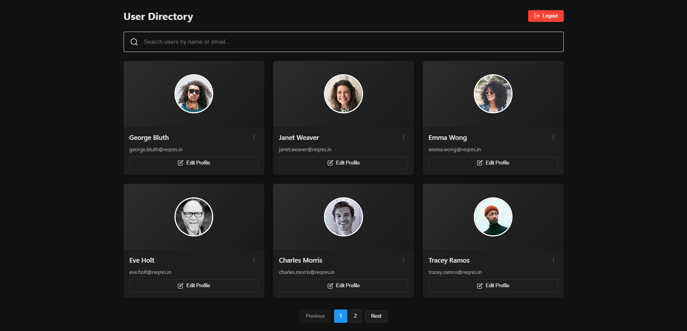

# EmployWise User Management App



A React application for user authentication and management using the Regres API.

## Features
- User login/logout functionality
- Paginated user listing
- Edit/delete user operations
- Responsive design with dark/light mode
- Client-side search

## Live Demo
[View on Vercel](https://employwise-app-two.vercel.app/)

## Installation
```bash
# Clone the repository
git clone https://github.com/PrathameshIngole/employwise-app.git
cd employwise-app

# Install dependencies
npm install

# Start the development server
npm start
```

### Access the app at:
```
http://localhost:3000
```

## Tech Stack
- React 19
- React Router 7
- Material-UI
- Axios for API calls
- Context API for state management

## API Usage
| Feature       | Endpoint                  |
|--------------|--------------------------|
| Login        | `POST /api/login`        |
| Get Users    | `GET /api/users?page={page}` |
| Update User  | `PUT /api/users/{id}`    |
| Delete User  | `DELETE /api/users/{id}` |

## Default Credentials
```plaintext
Email: eve.holt@regres.in
Password: cityslicka
```

## Assumptions
1. Using mock API (Regres) so changes aren't persisted permanently.
2. Pagination resets on page refresh.
3. Mobile-first design approach.

## Deployment
Deployed using Vercel. The app automatically builds from the main branch.

## Available Scripts
```bash
npm start       # Runs the app
npm run build  # Creates production build
npm test       # Runs tests
